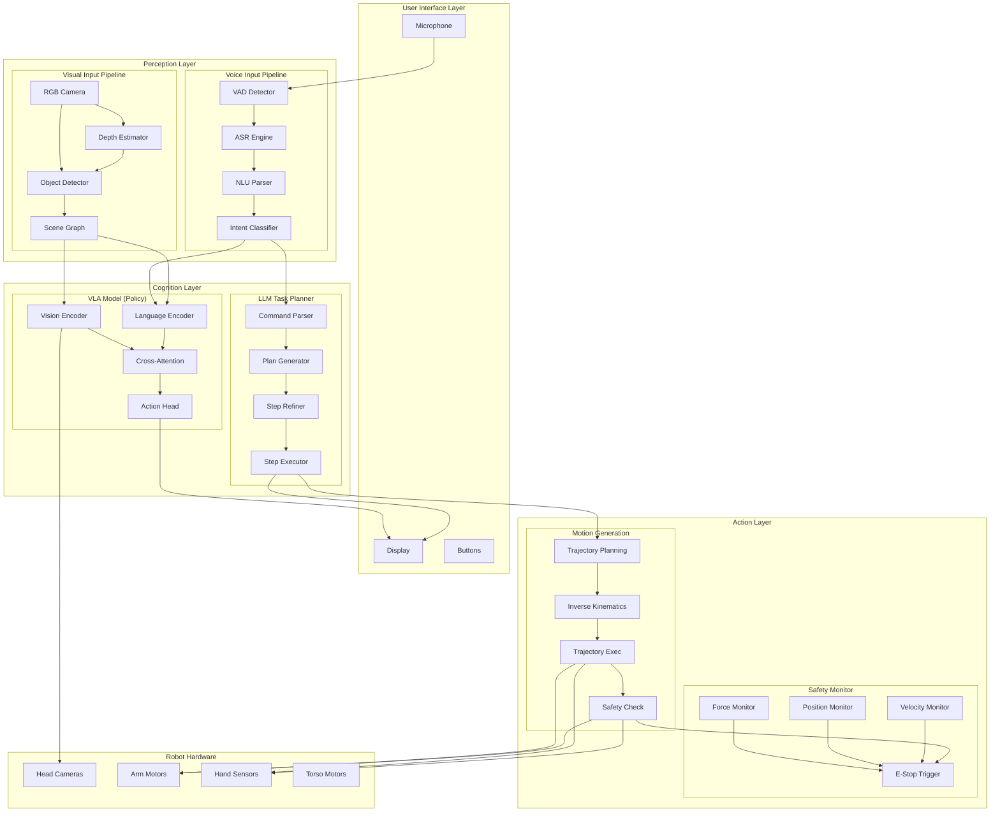
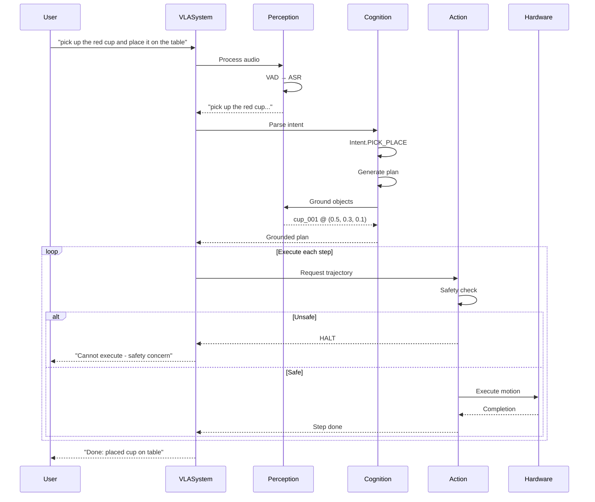
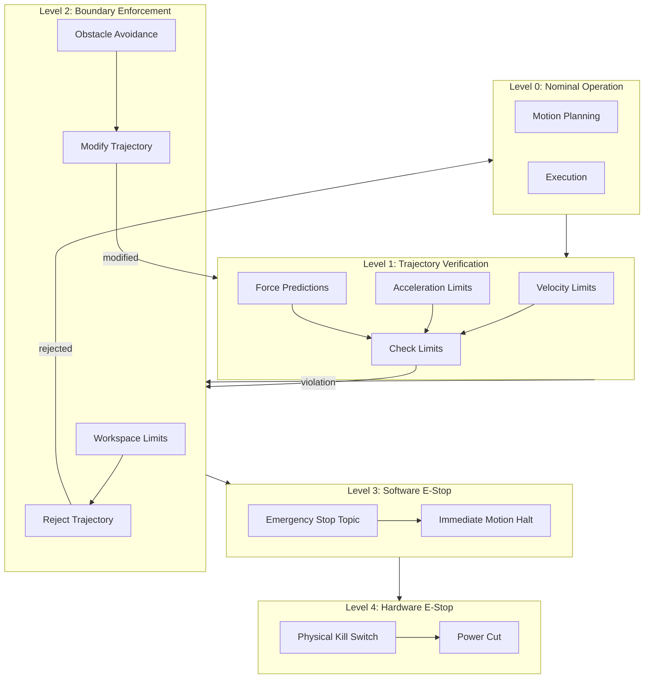
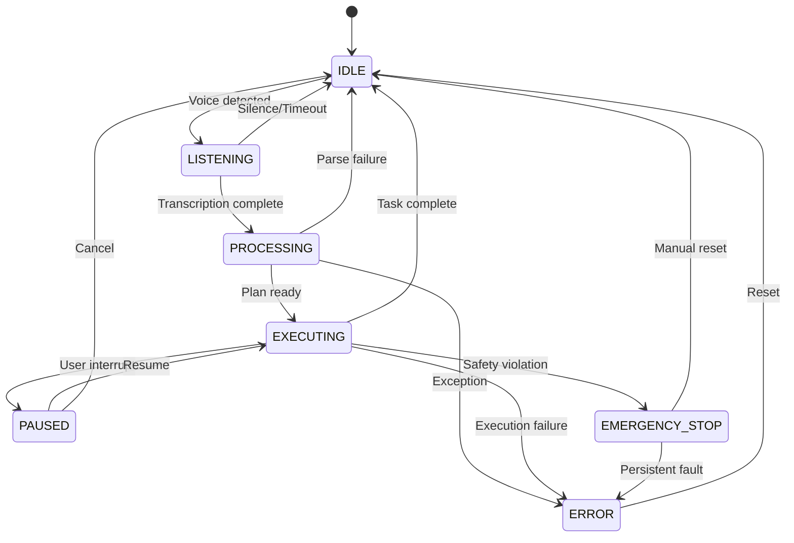

<<<<<<< HEAD
---
sidebar_position: 4
title: Capstone Architecture Diagram
---

# Capstone Architecture Diagram

## Complete VLA System Architecture

## Data Flow for Voice Command

## Safety Layer Hierarchy

## System State Machine

=======
---
sidebar_position: 4
title: Capstone Architecture Diagram
---

# Capstone Architecture Diagram

## Complete VLA System Architecture

## Data Flow for Voice Command

## Safety Layer Hierarchy

## System State Machine

>>>>>>> 5cf5f6818272e652910633754d301908ff0bb236
