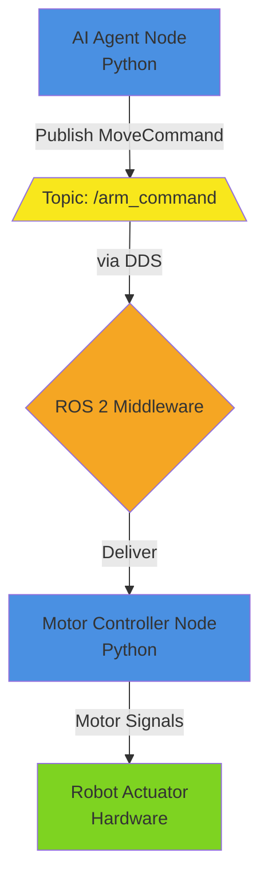

# Diagram: AI Decision to Robot Actuator Signal Flow

**ID**: `ros2-signal-flow`
**Chapter**: Chapter 2 - ROS 2 Architecture Fundamentals
**Date**: 2025-12-21

## Purpose

This diagram illustrates the complete signal path from an AI agent's decision through ROS 2 middleware to a physical robot actuator. It demonstrates how ROS 2 acts as the "nervous system" connecting intelligent decision-making (software) to physical movement (hardware), which is the core concept of Module 1.

## Components

1. **AI Agent Node** (type: software_node)
   - Description: Python node running decision logic (e.g., behavior tree, policy network)
   - Shape: rectangle
   - Color/Style: Blue (software)

2. **ROS 2 DDS Middleware** (type: middleware)
   - Description: Data Distribution Service layer handling message routing and discovery
   - Shape: ellipse
   - Color/Style: Orange (infrastructure)

3. **Motor Controller Node** (type: software_node)
   - Description: Python node translating high-level commands to motor-specific signals
   - Shape: rectangle
   - Color/Style: Blue (software)

4. **Robot Actuator** (type: hardware)
   - Description: Physical motor/servo executing movement
   - Shape: rounded_rectangle
   - Color/Style: Green (hardware)

5. **Topic: /arm_command** (type: data)
   - Description: ROS 2 topic carrying movement commands
   - Shape: diamond
   - Color/Style: Yellow (data channel)

## Connections

| From | To | Type | Label | Style |
|------|----|----|-------|-------|
| AI Agent Node | Topic: /arm_command | data_flow | Publish(MoveCommand) | solid_arrow |
| Topic: /arm_command | ROS 2 DDS Middleware | data_flow | Route message | dashed_arrow |
| ROS 2 DDS Middleware | Motor Controller Node | data_flow | Deliver to subscriber | solid_arrow |
| Motor Controller Node | Robot Actuator | control_flow | Send motor signals | solid_arrow |

**Flow Types**:
- `data_flow`: ROS 2 messages moving through the system
- `control_flow`: Direct hardware control signals

**Style Guide**:
- `solid_arrow`: Primary flow path
- `dashed_arrow`: Middleware internal operation (abstracted from nodes)

## Diagram Flow (Textual Representation)

```
[AI Agent Node]
    ↓ (Publish: topic=/arm_command, msg=MoveCommand{angle=45°})
[Topic: /arm_command]
    ↓ (via DDS Middleware)
[ROS 2 DDS Middleware]
    ↓ (Deliver to subscribers)
[Motor Controller Node]
    ↓ (Translate to motor signals: PWM, voltage, etc.)
[Robot Actuator] → Physical Movement
```

## Labels & Legend

**Symbol Legend**:
- Blue rectangles: Software nodes (run as separate processes)
- Orange ellipse: Middleware layer (transparent to nodes)
- Yellow diamond: Topic (named message channel)
- Green rounded rectangle: Physical hardware
- Solid arrows: Primary data/control flow
- Dashed arrows: Internal middleware routing

**Key Insight**: AI Agent and Motor Controller have NO direct connection - all communication via ROS 2 topics and middleware. This decoupling allows:
- Nodes on different machines
- Multiple subscribers to same command
- Independent node restart/replacement

## Annotations & Notes

- **Note 1**: AI Agent doesn't know Motor Controller exists - it only publishes to a topic. This is publish-subscribe decoupling.
- **Note 2**: DDS Middleware handles serialization, discovery, and network transport automatically.
- **Note 3**: Motor Controller validates commands before sending to hardware (e.g., check angle limits).
- **Note 4**: Real-world example: AI Agent runs on powerful GPU machine, Motor Controller on embedded ARM board physically attached to robot.

## Example Instantiation

**Scenario**: Humanoid robot reaching for an object

- AI Agent Node = "Vision-based reaching policy" (decides target joint angles)
- Topic: /arm_command = Publishes `JointCommand{shoulder=30°, elbow=45°, wrist=10°}`
- Motor Controller Node = "Dynamixel servo controller" (converts angles to servo commands)
- Robot Actuator = Dynamixel AX-12 servo motors

**Message Flow**:
1. AI Agent: "Object at (x,y,z), compute inverse kinematics → publish joint angles"
2. Topic: Queues message (if subscriber slow)
3. DDS Middleware: Discovers Motor Controller is subscribed, routes message
4. Motor Controller: Validates angles, converts to servo protocol, sends via UART
5. Actuator: Servos move to target angles

## Rendering Suggestions

**Mermaid Syntax**:



**Alternative Tools**:
- draw.io: Use flowchart shapes, color-code by type
- Hand-drawn: Emphasize asynchronous nature with wavy arrows for topics

## Validation Checklist

- [x] Purpose clearly states learning value (decoupling via ROS 2)
- [x] All 5 components listed with types and shapes
- [x] All 4 connections documented in table
- [x] Flow direction is unambiguous (top-down)
- [x] Legend explains all symbols (shapes, colors, arrows)
- [x] Notes clarify decoupling and validation
- [x] Example instantiation provided (humanoid reaching)
- [x] Mermaid rendering suggestion included
- [x] No placeholders remain
