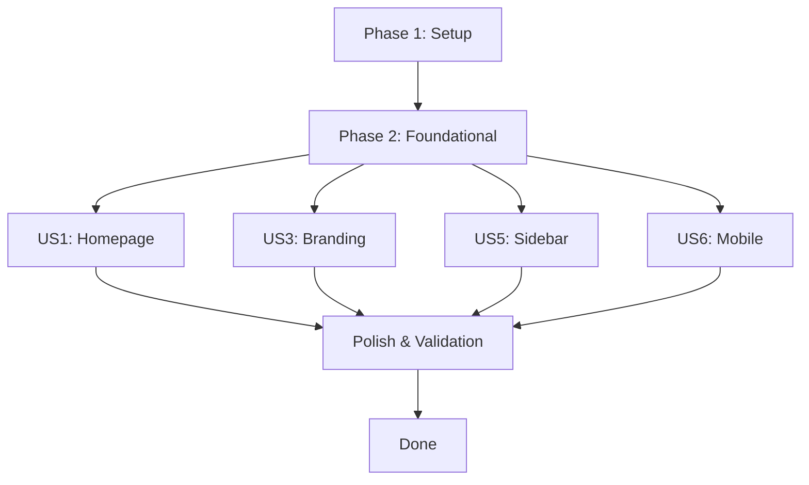

# Implementation Tasks: Premium Reading UI for Physical AI Book

**Branch**: `006-premium-reading-ui`
**Feature**: Premium Reading UI (Docusaurus)
**Created**: 2025-12-24

## Dependency Graph

## Phase Completion Order

1. Phase 1: Setup (must complete first)
2. Phase 2: Foundational CSS Theme (blocking for all user stories)
3. Phases 3-6: User Stories (can be done in parallel after Phase 2)
4. Phase 7: Polish & Validation (final)

## Phase 1: Setup

**Goal**: Prepare project structure and verify existing files

**Independent Test Criteria**: All required files exist at expected paths

### Tasks

- [ ] T001 Create static/img directory if missing at book_frontend/static/img/
- [ ] T002 Verify book_frontend/src/css/custom.css exists
- [ ] T003 Verify book_frontend/src/pages/index.tsx exists
- [ ] T004 Verify book_frontend/src/pages/index.module.css exists
- [ ] T005 Verify book_frontend/docusaurus.config.ts exists

## Phase 2: Foundational CSS Theme

**Goal**: Define CSS custom properties for colors, typography, spacing, and shadows

**Independent Test Criteria**: `npm run build` passes without CSS errors; browser devtools shows CSS custom properties defined

### Tasks

- [ ] T010 Create CSS custom properties for color palette in book_frontend/src/css/custom.css
  - Primary colors (#26A69A and variants)
  - Accent colors (#FFC857)
  - Light mode backgrounds (#F8FAFC)
  - Dark mode backgrounds (#0B1220)
  - Text colors for both modes
- [ ] T011 Define typography scale in book_frontend/src/css/custom.css
  - Font families (Inter/system-ui)
  - Font sizes (xs to 4xl)
  - Font weights
  - Line heights
- [ ] T012 Define spacing scale in book_frontend/src/css/custom.css
  - Spacing tokens (1-16)
- [ ] T013 Define border radius and shadows in book_frontend/src/css/custom.css
  - Border radius tokens (sm to full)
  - Shadow tokens (sm to xl)
- [ ] T014 Define transition tokens in book_frontend/src/css/custom.css
  - Fast, normal, slow transitions
- [ ] T015 Override Docusaurus Infima variables in book_frontend/src/css/custom.css
  - --ifm-color-primary family
  - Background and font overrides for light/dark mode
- [ ] T016 [P] Apply base typography to body, headings, links in book_frontend/src/css/custom.css

## Phase 3: US1 - Homepage Experience

**Goal**: Redesign homepage with hero section and module cards with robot icons

**Independent Test Criteria**: Homepage loads at book_frontend/ URL; hero section visible; 4 module cards displayed in grid; hover effects work

### Tasks

- [ ] T020 [P] [US1] Redesign homepage hero section in book_frontend/src/pages/index.tsx
  - Remove default Docusaurus hero
  - Add custom hero with book title and tagline
- [ ] T021 [P] [US1] Create module card data structure in book_frontend/src/pages/index.tsx
  - 4 modules: ROS 2, Digital Twin, AI-Robot Brain, VLA
  - Links to first chapter of each module
- [ ] T022 [P] [US1] Create inline SVG robot icons in book_frontend/src/pages/index.tsx
  - Robot icon for ROS 2 module
  - Cube icon for Digital Twin
  - Brain icon for AI-Robot Brain
  - Eye icon for VLA
- [ ] T023 [P] [US1] Implement module card component in book_frontend/src/pages/index.tsx
  - Icon, title, description, link
  - Clean layout with soft shadows
- [ ] T024 [P] [US1] Style homepage hero in book_frontend/src/pages/index.module.css
  - Centered content
  - Appropriate padding
  - Teal accent colors
- [ ] T025 [P] [US1] Style module cards grid in book_frontend/src/pages/index.module.css
  - CSS Grid layout
  - Responsive columns
  - Rounded corners
- [ ] T026 [P] [US1] Add hover effects for module cards in book_frontend/src/pages/index.module.css
  - Shadow change
  - Subtle lift effect
- [ ] T027 [P] [US1] Add Start Reading CTA button in book_frontend/src/pages/index.tsx
  - Links to intro page
  - Accent color styling

## Phase 4: US3 - Branding & Logo Integration

**Goal**: Add navbar logo and favicon with teal/yellow palette

**Independent Test Criteria**: Logo visible in navbar; favicon appears in browser tab; colors match palette

### Tasks

- [ ] T040 [P] [US3] Create SVG logo for navbar at book_frontend/static/img/logo.svg
  - Physical AI / robotics themed
  - Uses #26A69A and #FFC857 colors
  - Small, subtle design
- [ ] T041 [P] [US3] Create favicon.ico at book_frontend/static/img/favicon.ico
  - 32x32 pixels minimum
  - Uses brand colors
- [ ] T042 [US3] Update docusaurus.config.ts with logo configuration
  - Add navbar.logo.src pointing to img/logo.svg
  - Add navbar.logo.alt with "Physical AI Book Logo"
- [ ] T043 [US3] Update docusaurus.config.ts with favicon configuration
  - Add favicon: 'img/favicon.ico'
- [ ] T044 [P] [US3] Add navbar styling in book_frontend/src/css/custom.css
  - Logo sizing (small, subtle)
  - Alignment in navbar

## Phase 5: US5 - Sidebar Navigation

**Goal**: Style sidebar with calm highlight colors and rounded edges

**Independent Test Criteria**: Sidebar items have rounded edges; active state uses teal highlight; hover feedback is subtle

### Tasks

- [ ] T050 [P] [US5] Style sidebar container in book_frontend/src/css/custom.css
  - Background color
  - Border handling
- [ ] T051 [P] [US5] Add rounded edges to sidebar links in book_frontend/src/css/custom.css
  - Border radius on menu items
- [ ] T052 [P] [US5] Style sidebar active state in book_frontend/src/css/custom.css
  - Teal highlight color (#26A69A)
  - Left border accent
  - Background tint
- [ ] T053 [P] [US5] Add subtle hover feedback in book_frontend/src/css/custom.css
  - Background color change
  - No heavy animations
- [ ] T054 [P] [US5] Style sidebar section headers in book_frontend/src/css/custom.css
  - Typography hierarchy
  - Spacing

## Phase 6: US6 - Mobile Experience

**Goal**: Ensure responsive design for mobile devices (320px-428px)

**Independent Test Criteria**: Mobile viewport shows stacked cards; no horizontal scroll; touch targets 44px+

### Tasks

- [ ] T060 [P] [US6] Add mobile breakpoint for homepage in book_frontend/src/pages/index.module.css
  - 768px breakpoint for tablet
  - Single column layout
- [ ] T061 [P] [US6] Add small screen breakpoint in book_frontend/src/pages/index.module.css
  - 428px breakpoint for mobile
  - Full-width cards
- [ ] T062 [P] [US6] Ensure touch targets are 44px+ in book_frontend/src/css/custom.css
  - Button sizing
  - Link padding
- [ ] T063 [P] [US6] Prevent horizontal scrolling on mobile in book_frontend/src/css/custom.css
  - Overflow-x: hidden
  - Safe area padding
- [ ] T064 [P] [US6] Add responsive sidebar styles in book_frontend/src/css/custom.css
  - Collapsible on mobile
  - Proper touch targets
- [ ] T065 [P] [US6] Test dark mode on mobile in book_frontend/src/css/custom.css
  - Verify colors adapt correctly
  - No blue colors

## Phase 7: Polish & Validation

**Goal**: Final polish, build validation, visual inspection

**Independent Test Criteria**: `npm run build` passes; no blue colors in design; accessibility check passes

### Tasks

- [ ] T070 Run npm run build to validate all changes at book_frontend/
- [ ] T071 [P] Verify no blue colors in design using browser devtools at book_frontend/src/css/custom.css
- [ ] T072 [P] Check color contrast meets accessibility standards in book_frontend/src/css/custom.css
- [ ] T073 [P] Verify light/dark mode toggle works correctly
- [ ] T074 [P] Test all navigation links work correctly
- [ ] T075 [P] Remove any visual clutter or unnecessary elements
- [ ] T076 [P] Ensure performance (page load <3 seconds)
- [ ] T077 [P] Final visual inspection of homepage and content pages

## Parallel Execution Examples

### After Phase 2 (Foundational):

**Can run in parallel**:
- T020-T027 (US1 Homepage) + T040-T044 (US3 Branding)
- T050-T054 (US5 Sidebar) + T060-T065 (US6 Mobile)

### Independent components:
- Icons can be created while config is updated
- CSS styling for different sections can be done in parallel
- Mobile styles don't depend on desktop polish

## Summary

| Phase | Task Count | User Stories |
|-------|------------|--------------|
| Phase 1: Setup | 5 | - |
| Phase 2: Foundational | 7 | - |
| Phase 3: US1 Homepage | 8 | US1 |
| Phase 4: US3 Branding | 5 | US3 |
| Phase 5: US5 Sidebar | 5 | US5 |
| Phase 6: US6 Mobile | 6 | US6 |
| Phase 7: Polish | 8 | Cross-cutting |
| **Total** | **44** | **4** |

**Suggested MVP**: Complete Phases 1-4 (Setup, Foundational, Homepage, Branding) for initial release with core visual identity. Sidebar and Mobile can follow in subsequent iterations.
